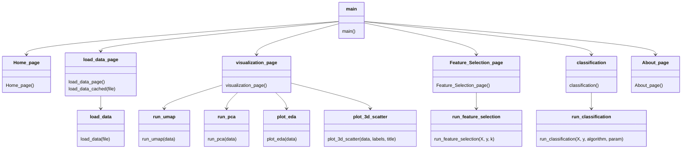

# Data Mining and Analysis Application

This repository contains a web-based application for data mining and analysis using Streamlit. The application integrates tabular data and supports various functions including data loading, visualization, feature selection, and classification.

## Features

- Load tabular data (CSV, Excel, TSV)
- 3D visualizations using PCA and UMAP
- Exploratory Data Analysis (EDA) charts
- Feature selection
- Machine Learning classification (KNN and SVM)
- Performance comparison before and after feature selection

## Repository Structure

```
.
├── src/
│   ├── lib/
│   │   ├── functions/
│   │   └── pages/
│   ├── Dockerfile
│   ├── main.py
│   └── README.md
└── README.md
```

### UML



## Installation and Usage

There are three ways to run this application:

### 1. Bare Metal

To run the application directly on your machine:

1. Clone the repository:

   ```bash
   git clone https://github.com/sudo455/texnologia_logismikoy_sptember_2024.git
   cd texnologia_logismikoy_sptember_2024/src
   ```

2. Create and activate a virtual environment:

   ```bash
   python -m venv venv
   source venv/bin/activate  # On Windows, use `venv\Scripts\activate`
   ```

3. Install the required packages:

   ```bash
   pip install -r requirements.txt
   ```

4. Run the Streamlit app:

   ```bash
   streamlit run main.py
   ```

5. Open your browser and navigate to `http://localhost:8501`

### 2. Docker Build

To build and run the Docker image locally:

1. Clone the repository and navigate to the src directory:

   ```bash
   git clone https://github.com/sudo455/texnologia_logismikoy_sptember_2024.git
   cd texnologia_logismikoy_sptember_2024/src
   ```

2. Build the Docker image:

   ```bash
   sudo docker build -t texnologia_logismikoy:latest .
   ```

3. Run the Docker container:

   ```bash
    sudo docker run -d -p 8501:80 --name texnologia_logismikoy ghcr.io/sudo455/tenologia_logismikoy:latest
   ```

4. Open your browser and navigate to `http://localhost:8501`

### 3. Docker Hub

To run the application using the pre-built Docker image from Docker Hub:

```bash
sudo docker run -d -p 8501:8501 --name texnologia_logismikoy drefficient/texnologia_logismikoy:latest
```

To run the application using the pre-built Docker image image from github container hub:

```bash
sudo docker run -d -p 8501:80 --name texnologia_logismikoy ghcr.io/sudo455/texnologia_logismikoy:latest
```

Then open your browser and navigate to `http://localhost:8501`

# AUTHORS

Angelos Moraitis
Theoxaris parisis
